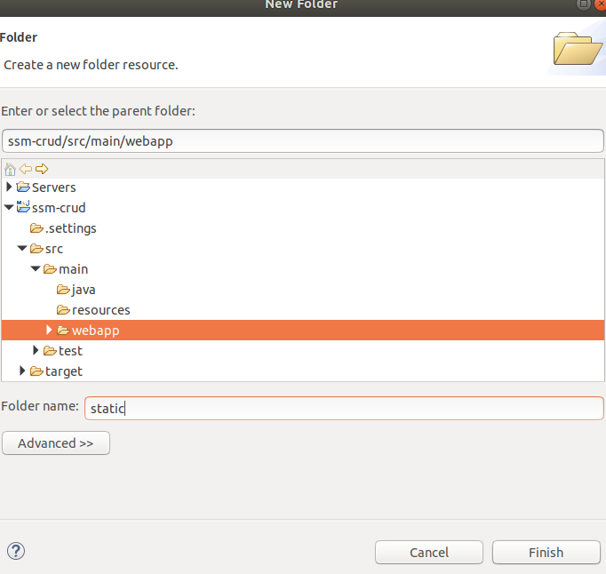
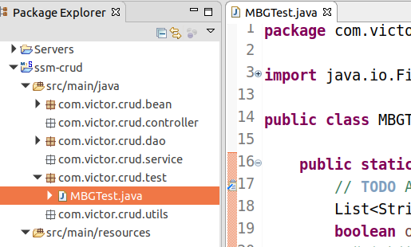
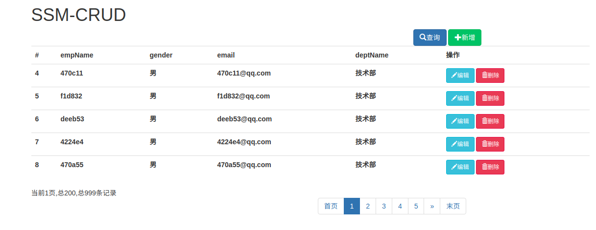

# SSM项目的构建

## 1、创建一个maven工程


- eclipse创建maven工程后，pom.xml报错：web.xml is missing and <failOnMissingWebXml> is set to true

解决问题：右击项目-->java EE tools-->Generate  Deployment Descriptor Stub。

系统会自动创建一个web.xml文件放到src/main/webapp/WEB_INF下。

注：xml文件格式化快捷键，Ctrl+Shift+F,为了避免和搜狗拼音的简体繁体冲突，可以勾掉搜狗的快捷键。

## 2、引入项目依赖的jar包

- spring
- springmvc
- mybatis
- 数据库连接池，驱动包
- 其他

#### 1、引入Spring相关包的操作

##### 1、[maven中央仓库](https://mvnrepository.com/)

##### 2、引入springmvc的包

```xml
<!-- https://mvnrepository.com/artifact/org.springframework/spring-webmvc -->
<dependency>
    <groupId>org.springframework</groupId>
    <artifactId>spring-webmvc</artifactId>
    <version>4.3.7.RELEASE</version>
</dependency>
```

##### 3、引入Spring-jdbc的包

```xml
<!-- https://mvnrepository.com/artifact/org.springframework/spring-jdbc -->
<dependency>
    <groupId>org.springframework</groupId>
    <artifactId>spring-jdbc</artifactId>
    <version>4.3.7.RELEASE</version>
</dependency>
```

##### 4、引入Spring面向切面编程模块Spring aspects

```xml
<!-- https://mvnrepository.com/artifact/org.springframework/spring-aspects -->
<dependency>
    <groupId>org.springframework</groupId>
    <artifactId>spring-aspects</artifactId>
    <version>4.3.7.RELEASE</version>
</dependency>
```

#### 2、引入MyBatis相关包的操作

##### 1、引入mybatis的包

```xml
<!-- https://mvnrepository.com/artifact/org.mybatis/mybatis -->
<dependency>
    <groupId>org.mybatis</groupId>
    <artifactId>mybatis</artifactId>
    <version>3.4.2</version>
</dependency>
```

##### 2、引入mybatis整合Spring的适配包

```xml
<!-- https://mvnrepository.com/artifact/org.mybatis/mybatis-spring -->
<dependency>
    <groupId>org.mybatis</groupId>
    <artifactId>mybatis-spring</artifactId>
    <version>1.3.1</version>
</dependency>
```

#### 3、引入数据库连接池以及驱动

##### 1、引入c3p0数据库连接池的包

```xml
<!-- https://mvnrepository.com/artifact/c3p0/c3p0 -->
<dependency>
    <groupId>c3p0</groupId>
    <artifactId>c3p0</artifactId>
    <version>0.9.1.2</version>
</dependency>

```

##### 2、引入mysql8.0.15的驱动包

查看本地mysql的版本，引入相应的驱动包

首先进入mysql

```shell
mysql -uroot -proot
status;
```

```xml
<!-- https://mvnrepository.com/artifact/mysql/mysql-connector-java -->
<dependency>
    <groupId>mysql</groupId>
    <artifactId>mysql-connector-java</artifactId>
    <version>8.0.15</version>
</dependency>
```

#### 4、其他模块

由于要开发web项目，先把常用的，jstl,servlet-api,junit先引入进来

##### 1、引入jstl包

```xml
<!-- https://mvnrepository.com/artifact/jstl/jstl -->
<dependency>
    <groupId>jstl</groupId>
    <artifactId>jstl</artifactId>
    <version>1.2</version>
</dependency>
```

##### 2、引入servlet-api包

```xml
<!-- https://mvnrepository.com/artifact/javax.servlet/servlet-api -->
<dependency>
    <groupId>javax.servlet</groupId>
    <artifactId>servlet-api</artifactId>
    <version>2.5</version>
    <scope>provided</scope>
</dependency>
```

我们知道tomcat服务器里面有servlet包，但是不引入的话jsp页面会报错，所以加入<scope>provided</scope>标签表示人家已经提供的。也即是当项目发布到服务器上的时候，这个包会被自动剔除掉。

##### 3、引入junit单元测试包

```xml
<!-- https://mvnrepository.com/artifact/junit/junit -->
<dependency>
    <groupId>junit</groupId>
    <artifactId>junit</artifactId>
    <version>4.2</version>
    <scope>test</scope>
</dependency>
```

## 3、引入BootStrap前端框架

[bootstrap中文官网](https://github.com/twbs/bootstrap/releases/download/v3.3.7/bootstrap-3.3.7-dist.zip)

#### 1、下载bootstrap然后解压。

#### 2、在webapp目录下建立一个folder命名为叫static文件夹



#### 3、把解压的bootstrap-3.3.7-dist复制到新建的static目录下

#### 4、新建一个index.jsp引入bootstrap样式和基本文件

[bootstrap官网](https://www.bilibili.com/video/av35988777/?p=5)

```jsp
<link href="static/bootstrap-3.3.7-dist/css/bootstrap.min.css" rel="stylesheet">
<script src="static/bootstrap-3.3.7-dist/js/bootstrap.min.js"></script>
```

## 4、编写ssm整合的关键配置文件

#### 1、web.xml配置文件的编写

```xml
<?xml version="1.0" encoding="UTF-8"?>
<web-app
	xmlns:xsi="http://www.w3.org/2001/XMLSchema-instance"
	xmlns="http://java.sun.com/xml/ns/javaee"
	xsi:schemaLocation="http://java.sun.com/xml/ns/javaee http://java.sun.com/xml/ns/javaee/web-app_2_5.xsd"
	id="WebApp_ID"
	version="2.5">
	<display-name>ssm-crud</display-name>

	<!-- 1、启动spring的容器(快捷键：alt+/) -->
	<!-- needed for ContextLoaderListener -->
	<context-param>
		<param-name>contextConfigLocation</param-name>
		<param-value>classpath:applicationContext.xml</param-value>
	</context-param>

	<!-- Bootstraps the root web application context before servlet initialization -->
	<listener>
		<listener-class>org.springframework.web.context.ContextLoaderListener</listener-class>
	</listener>

	<!-- 2、springmvc的前端控制器，拦截所有请求 -->
	<!-- The front controller of this Spring Web application, responsible for 
		handling all application requests -->
	<servlet>
		<servlet-name>dispatcherServlet</servlet-name>
		<servlet-class>org.springframework.web.servlet.DispatcherServlet</servlet-class>
		<!-- 可以不指定配置文件路径，但是必须要在与web.xml同级目录下 有一个springmvc配置文件，与<servlet-name>标签属性名-servlet.xml的配置文件 
			eg:dispatcherServlet-servlet.xml <init-param> <param-name>contextConfigLocation</param-name> 
			<param-value>location</param-value> </init-param> -->
		<load-on-startup>1</load-on-startup>
	</servlet>

	<!-- Map all requests to the DispatcherServlet for handling -->
	<servlet-mapping>
		<servlet-name>dispatcherServlet</servlet-name>
		<!-- 让它拦截所有请求 -->
		<url-pattern>/</url-pattern>
	</servlet-mapping>

	<!-- 3、配上springmvc中带的字符编码过滤器 Ctrl+Shift+T，
	输入CharacterEncodingFilter,打开对应的class文件。 
	当过滤器有多个，这个肯定有先后顺序的。
	******注意：一定要把字符编码过滤器放在所有过滤器之前。******
	-->
	<filter>
		<filter-name>CharacterEncodingFilter</filter-name>
		<!-- 右键选择，copy qualified name复制全类名 -->
		<filter-class>org.springframework.web.filter.CharacterEncodingFilter</filter-class>
		<!-- 在初始化参数的时候，给它指定有一个属性，这个属性在CharacterEncodingFilter 叫encoding的属性，指定我们要用的字符编码集用utf-8 -->
		<init-param>
			<param-name>encoding</param-name>
			<param-value>utf-8</param-value>
		</init-param>

		<!-- springmvc4中的CharacterEncodingFilter， 多了两个属性：forceRequestEncoding，forceResponseEncoding -->
		<!-- 设置这下面两个属性都为true，让它强制请求和响应编码为utf-8 -->
		<init-param>
			<param-name>forceRequestEncoding</param-name>
			<param-value>true</param-value>
		</init-param>
		<init-param>
			<param-name>forceResponseEncoding</param-name>
			<param-value>true</param-value>
		</init-param>
	</filter>
	<filter-mapping>
		<filter-name>CharacterEncodingFilter</filter-name>
		<!-- 过滤所有请求 -->
		<url-pattern>/*</url-pattern>
	</filter-mapping>
	
	<!-- 4、使用Rest风格的URI，而提交页面的请求，
	是发不出PUT，DELETE这样的请求的。所以还需要一个过滤器HiddenHttpMethodFilter
	它会将页面的post请求转为指定的delete或者put请求。
	-->
	<filter>
		<filter-name>HiddenHttpMethodFilter</filter-name>
		<filter-class>org.springframework.web.filter.HiddenHttpMethodFilter</filter-class>
	</filter>
	<filter-mapping>
		<filter-name>HiddenHttpMethodFilter</filter-name>
		<url-pattern>/*</url-pattern>
	</filter-mapping>
	
</web-app>
```

#### 2、springmvc配置文件的编写

```xml
<?xml version="1.0" encoding="UTF-8"?>
<beans
	xmlns="http://www.springframework.org/schema/beans"
	xmlns:xsi="http://www.w3.org/2001/XMLSchema-instance"
	xmlns:context="http://www.springframework.org/schema/context"
	xmlns:mvc="http://www.springframework.org/schema/mvc"
	xsi:schemaLocation="http://www.springframework.org/schema/mvc http://www.springframework.org/schema/mvc/spring-mvc-4.3.xsd
		http://www.springframework.org/schema/beans http://www.springframework.org/schema/beans/spring-beans.xsd
		http://www.springframework.org/schema/context http://www.springframework.org/schema/context/spring-context-4.3.xsd">

	<!--SpringMVC的配置文件，包含网站跳转逻辑的控制配置 -->
	
	<!-- 1、配置包扫描，让它只扫描@Controller注解的 -->
	<context:component-scan base-package="com.victor" use-default-filters="false">
		<!-- 让它只扫描控制器 -->
		<context:include-filter type="annotation" expression="org.springframework.stereotype.Controller"/>
	</context:component-scan>
	
	<!-- 2、配置视图解析器，方便页面返回解析 -->
	<bean class="org.springframework.web.servlet.view.InternalResourceViewResolver">
		<property name="prefix" value="/WEB-INF/views/"></property>
		<property name="suffix" value=".jsp"></property>
	</bean>
	
	<!-- 两个标准配置  -->
	<!-- 3、将springmvc不能处理的请求交给tomcat 
		这样实现了动态，静态资源都能访问成功了
     -->
	<mvc:default-servlet-handler/>
	<!-- 4、能支持springmvc更高级的一些功能，比如JSR303教研，
	快捷的ajax，更重要的是来映射动态请求-->
	<mvc:annotation-driven></mvc:annotation-driven>
</beans>
```

#### 3、spring的配置文件

##### 1、applicationContext.xml配置文件

```xml
<?xml version="1.0" encoding="UTF-8"?>
<beans
	xmlns="http://www.springframework.org/schema/beans"
	xmlns:xsi="http://www.w3.org/2001/XMLSchema-instance"
	xmlns:context="http://www.springframework.org/schema/context"
	xmlns:aop="http://www.springframework.org/schema/aop"
	xmlns:tx="http://www.springframework.org/schema/tx"
	xsi:schemaLocation="http://www.springframework.org/schema/beans http://www.springframework.org/schema/beans/spring-beans.xsd
		http://www.springframework.org/schema/context http://www.springframework.org/schema/context/spring-context-4.3.xsd
		http://www.springframework.org/schema/aop http://www.springframework.org/schema/aop/spring-aop-4.3.xsd
		http://www.springframework.org/schema/tx http://www.springframework.org/schema/tx/spring-tx-4.3.xsd">
	
	<!-- 1、在spring的配置文件中，让Spring不扫控制器。 -->
	<context:component-scan base-package="com.victor">
		<context:exclude-filter type="annotation" expression="org.springframework.stereotype.Controller"/>
	</context:component-scan>
	<!-- spring的配置文件：这里主要配置和业务逻辑有关的 /ssm-crud/src/main/resources/dbconfig.properties-->
	<!-- 数据源，事务控制 ，xxx-->
	
	<!-- ================================一、数据源配置============================================== -->	
	<!--2、context:property-placeholder用来引入外部配置文件 -->
	<context:property-placeholder location="classpath:dbconfig.properties"/>
	
	<!--3、配置c3p0数据源(用alt+/快捷键进行补全) -->
	<bean id="pooledDataSource" class="com.mchange.v2.c3p0.ComboPooledDataSource">
		<!--这些数据库设置，我们都不是写死的，
		因此创建一个dbconfig.properties文件
		为了不跟其他配置文件混乱，跟数据源有关的都加上jdbc.的前缀，
		 -->
		<property name="jdbcUrl" value="${jdbc.jdbcUrl}"></property>
		<property name="driverClass" value="${jdbc.driverClass}"></property>
		<property name="user" value="${jdbc.user}"></property>
		<property name="password" value="${jdbc.password}"></property>
	</bean>
	<!-- ========================================================================================== -->
	
	
	<!-- =========================二、MyBatis整合配置====================================================== -->
	<!-- 4、配置mybatis的整合 -->
	<!-- 可以帮我们创建sqlSessionFactory -->
	<bean id="sqlSessionFactory" class="org.mybatis.spring.SqlSessionFactoryBean">
		<!-- 指定mybatis全局配置文件的位置-->
		<property name="configLocation" value="classpath:mybatis-config.xml"></property>
		<!-- 指定mybatis的数据源引用文件 -->
		<property name="dataSource" ref="pooledDataSource"></property>
		<!-- 指定mybatis的mapper文件的位置 -->
		<property name="mapperLocations" value="classpath:mapper/*.xml"></property>
	</bean>
	
	<!-- 5、配置扫描器，将mybatis接口的实现加入到ioc容器中
	因为我们知道mybatis的接口的实现是一个代理对象，需要加到ioc容器中
	 -->
	 <bean class="org.mybatis.spring.mapper.MapperScannerConfigurer">
	 	<!-- 扫描所有的dao接口的实现，加入到ioc容器中-->
	 	<property name="basePackage" value="com.victor.crud.dao"></property>
	 </bean>
	 <!-- ========================================================================================== -->
	 
	 
	 <!-- ===============================三、事务控制的配置（非常重要）======================================================= -->	 
	 <!-- 6、事务控制的配置 -->
	 <!-- 数据源的开启关闭回滚操作，我们用事务管理器来做 -->
	 <bean id="transactionManager" class="org.springframework.jdbc.datasource.DataSourceTransactionManager">
	 	<!-- 控制住数据源 -->
	 	<!-- 告诉项目中用的数据源是哪个 -->
	 	<property name="dataSource" ref="pooledDataSource"></property>
	 </bean>
	 
	 <!-- 7、开启基于注解的事务 ，或者使用xml配置形式的事务
	 一般我们推荐：比较重要的事务都是使用配置xml文件的形式。
	 -->
	 <aop:config>
	 	<!-- 切入点表达式（也就是想要切入到哪些里面进行事务控制）
	 	首先是返回值，返回值类型：*为所有
	 	com.victor.crud.service..*(..):表示service包下的所有类，所有方法都来控制事务,括号里面的双点：表示这个方法里的参数任意多也行
	 	..：表示即使这个包下还有子包也行
	 	 -->
	 	<aop:pointcut expression="execution(* com.victor.crud.service..*(..))" id="txPoint"/>
	 	<!-- 配置事务增强(需要引入tx名称空间) -->
	 	<aop:advisor advice-ref="txAdvice" pointcut-ref="txPoint"/>
	 </aop:config>
	 
	 <!--8、配置事务增强(也就是事务如何切入) -->
	 <!-- 关键是跟事务管理器又产生什么联系的呢？
	 	其实是我们事务增强配置的时候有一个属性transaction-manager，
	 	它的值默认取值叫transactionManager，而我们的事务管理器的id正好是transactionManager
	 	如果事务管理器的id改了，也一定要把id复制粘贴到事务增强处。
	 	意思就是我们用这个事务管理器来控制事务，控制事务的细节，切哪些方法在<aop:point>标签配置处指定。
	 	哪些方法切入以后该怎么办，在<tx:advice>标签配置处指定。
	  -->
	 <tx:advice id="txAdvice" transaction-manager="transactionManager">
	 	<tx:attributes>
	 		<!-- *表示这个切入点切入的所有方法，都是事务方法 -->
	 		<tx:method name="*"/>
	 		<!-- 表示以get开始的所有方法(我们可以认为以get开始的方法都是查询，设置一个属性read-only=true,来进行优化)-->
	 		<tx:method name="get*" read-only="true"/>
	 	</tx:attributes>
	 </tx:advice>
	 <!-- ========================================================================================== -->
	 
	 
	 <!--Spring配置文件的核心点：
	 	数据源，与mybatis的整合，事务控制
	   -->
</beans>
```

##### 2、dbconfig.properties文件的写法

由于mysql8，driverClass=com.mysql.jdbc.Driver会报错

- 错误解决：Loading class `com.mysql.jdbc.Driver'. This is deprecated. The new driver class is `com.mysql.cj.jdb

  mysql其他版本:driverClass=com.mysql.jdbc.Driver

  mysql8以上版本:driverClass=com.mysql.cj.jdbc.Driver

```properties
jdbc.jdbcUrl=jdbc:mysql://localhost:3306/java?useSSL=false
jdbc.driverClass=com.mysql.cj.jdbc.Driver
jdbc.user=victor
jdbc.password=root
```

- 错误解决：java.sql.SQLNonTransientConnectionException: Public Key Retrieval is not allowed

  由于mysql8版本：

  ```properties
  jdbcUrl=jdbc:mysql://localhost:3306/java?useSSL=false&allowPublicKeyRetrieval=true
  ```

#### 4、mybatis的配置文件

##### 1、mybatis-cfg.xml

```xml
<?xml version="1.0" encoding="UTF-8" ?>
<!DOCTYPE configuration
  PUBLIC "-//mybatis.org//DTD Config 3.0//EN"
  "http://mybatis.org/dtd/mybatis-3-config.dtd">
<configuration>
	<!-- 开启驼峰命名规则 -->
	<settings>
		<setting name="mapUnderscoreToCamelCase" value="true"/>
	</settings>
	<!-- 类型别名的配置 -->
	<typeAliases>
		<package name="com.victor.crud.bean"/>
	</typeAliases>
</configuration>
```

##### 2、利用MyBatis Generator逆向工程

[MyBatis Generator的官网](http://www.mybatis.org/generator/configreference/xmlconfig.html)

- 引入mybatis generator的依赖

  ```xml
  <!-- https://mvnrepository.com/artifact/org.mybatis.generator/mybatis-generator-core -->
  <dependency>
      <groupId>org.mybatis.generator</groupId>
      <artifactId>mybatis-generator-core</artifactId>
      <version>1.3.5</version>
  </dependency>
  ```

- 给当前工程中创建一个mbg.xml文件

  ```xml
  <?xml version="1.0" encoding="UTF-8"?>
  <!DOCTYPE generatorConfiguration
    PUBLIC "-//mybatis.org//DTD MyBatis Generator Configuration 1.0//EN"
    "http://mybatis.org/dtd/mybatis-generator-config_1_0.dtd">
  
  <generatorConfiguration>
  
    <context id="DB2Tables" targetRuntime="MyBatis3">
      <!-- 配置数据库连接 -->
      <jdbcConnection driverClass="com.mysql.cj.jdbc.Driver"
          connectionURL="jdbc:mysql://localhost:3306/java?useSSL=false"
          userId="victor"
          password="root">
      </jdbcConnection>
      
  	<!-- Java的大数据类型解析 -->
      <javaTypeResolver >
        <property name="forceBigDecimals" value="false" />
      </javaTypeResolver>
  	
  	<!-- 指定javaBean生成的位置
  	windows系统的写法：targetProject=".\src\main\java":表示当前工程下的main的java工程下。
  macOS、linux系统的写法：targetProject="./src/main/java"
  	 -->
      <javaModelGenerator targetPackage="com.victor.crud.bean" targetProject="./src/main/java">
        <property name="enableSubPackages" value="true" />
        <property name="trimStrings" value="true" />
      </javaModelGenerator>
  
  	<!-- 指定sql映射文件生成的位置 -->
      <sqlMapGenerator targetPackage="mapper"  targetProject="./src/main/resources">
        <property name="enableSubPackages" value="true" />
      </sqlMapGenerator>
  
  	<!-- 指定dao接口生成的位置，mapper接口 -->
      <javaClientGenerator type="XMLMAPPER" targetPackage="com.victor.crud.dao"  targetProject="./src/main/java">
        <property name="enableSubPackages" value="true" />
      </javaClientGenerator>
  
  	<!-- table标签指定每个表的生成策略 
  	tableName="tbl_emp":指定表名，必须的属性。
  	domainObjectName="Employee"：指定生成的javabean的类名
  	-->
      <table tableName="tbl_emp" domainObjectName="Employee"></table>
      <table tableName="tbl_dept" domainObjectName="Department"></table>
  
    </context>
  </generatorConfiguration>
  ```

- 如何生成呢

  因为我们是java程序+xml配置文件的生成方式

  [生成逆向工程](http://www.mybatis.org/generator/running/runningWithJava.html)



- 运行这个测试类main方法生成就行。

```java
package com.victor.crud.test;

import java.io.File;
import java.io.IOException;
import java.util.ArrayList;
import java.util.List;

import org.mybatis.generator.api.MyBatisGenerator;
import org.mybatis.generator.config.Configuration;
import org.mybatis.generator.config.xml.ConfigurationParser;
import org.mybatis.generator.exception.XMLParserException;
import org.mybatis.generator.internal.DefaultShellCallback;

public class MBGTest {

	public static void main(String[] args) throws IOException, XMLParserException, Exception {
		// TODO Auto-generated method stub
		List<String> warnings = new ArrayList<String>();
		boolean overwrite = true;
		//指定当前项目下的mybatis-generator的配置文件
		File configFile = new File("mbg.xml");
		ConfigurationParser cp = new ConfigurationParser(warnings);
		Configuration config = cp.parseConfiguration(configFile);
		DefaultShellCallback callback = new DefaultShellCallback(overwrite);
		MyBatisGenerator myBatisGenerator = new MyBatisGenerator(config, callback, warnings);
		myBatisGenerator.generate(null);
		System.out.println("mybatis-generator successfully!");

	}

}
```

## 5、测试mapper

##### 1、插入批量数据

- 首先是applicationContext.xml修改

  ```xml
  	 <!-- 配置一个可以执行批量操作的sqlSession -->
  	 <bean id="sqlSession" class="org.mybatis.spring.SqlSessionTemplate">
  	 <!-- ref指向，mybatis配置好的sqlSessionFactory -->
  	 	<constructor-arg name="sqlSessionFactory" ref="sqlSessionFactory"></constructor-arg>
  	 	<!-- mybatis执行器默认类型不是bathc批量的，我们改成批量的 -->
  	 	<constructor-arg name="executorType" value="BATCH"></constructor-arg>
  	 </bean>
  ```

- 测试用例

  ```java
  package com.victor.crud.test;
  
  import java.util.UUID;
  
  import org.apache.ibatis.session.SqlSession;
  import org.junit.Test;
  import org.junit.runner.RunWith;
  import org.springframework.beans.factory.annotation.Autowired;
  import org.springframework.context.ApplicationContext;
  import org.springframework.context.support.ClassPathXmlApplicationContext;
  import org.springframework.test.context.ContextConfiguration;
  import org.springframework.test.context.junit4.SpringJUnit4ClassRunner;
  
  import com.victor.crud.bean.Department;
  import com.victor.crud.bean.Employee;
  import com.victor.crud.dao.DepartmentMapper;
  import com.victor.crud.dao.EmployeeMapper;
  
  /**
   * 测试dao层的工作
   * @author victor
   *推荐spring的项目就可以使用Spring的单元测试，可以自动注入我们需要的组件
   *1、导入SpringTest模块的依赖
   *2、使用@ContextConfiguration注解指定Spring配置文件的位置，可以自动帮我们创建ioc容器。
   *3、@RunWith是Junit里的注解，可以指定在运行单元测试的时候，用哪个来运行。
   *我们现在用Spring的单元测试模块，指定value值为SpringJUnit4ClassRunner.class
   *4、我们要用哪些组件，直接@Autowried要使用的哪些组件即可。
   */
  
  @RunWith(SpringJUnit4ClassRunner.class)
  @ContextConfiguration(locations= {"classpath:applicationContext.xml"})
  public class MapperTest {
  	
  	@Autowired
  	DepartmentMapper departmentMapper;
  	@Autowired
  	EmployeeMapper employeeMapper;
  	//自动注入一个批量的SqlSession
  	@Autowired
  	SqlSession sqlSession;
  	
  	/**
  	 * 测试DepartmentMapper
  	 */
  	@Test
  	public void testCRUD() {
  	/*原生的单元测试
  	 * 	//1、创建SpringIOC容器
  		ApplicationContext ioc=new ClassPathXmlApplicationContext("applicationContext.xml");
  		//2、容器中获取mapper
  		ioc.getBean(DepartmentMapper.class);
  	*/
  		System.out.println(departmentMapper);
  		//1、插入几个部门
  //		departmentMapper.insertSelective(new Department(null,"技术部"));
  //		departmentMapper.insertSelective(new Department(null,"测试部"));
  		//2、生成员工，测试员工插入
  //		employeeMapper.insertSelective(new Employee(null, "Tom", "M", "1397743321@qq.com", 1));
  		//批量操作可以用个for循环，但是效率不高
  		/**
  		 * for(){
  		 * employeeMapper.insertSelective(new Employeenew Employee(null, "Tom", "M", "1397743321@qq.com", 1));
  		 * }
  		 */
  		//3、批量插入多个员工；批量，使用可以执行批量操作的sqlSession
  		EmployeeMapper mapper=sqlSession.getMapper(EmployeeMapper.class);
  		for(int i=0;i<1000;i++) {
  			String uid=UUID.randomUUID().toString().substring(0, 5)+i;
  			mapper.insertSelective(new Employee(null,uid,"M",uid+"@qq.com",1));
  		}
  		System.out.println("BATCH Successfully!");
  	}
  }
  
  ```

## 6、查询页面的展示

##### 1、访问index.jsp页面

URI：/emps

##### 2.index.jsp页面发送出查询员工列表请求

```jsp
<%@ page language="java" contentType="text/html; charset=UTF-8"
    pageEncoding="UTF-8"%>
<<jsp:forward page="/emps"></jsp:forward>  
```

##### 3、EmployeeController来接受请求，查出员工数据

- 建立一个EmployeeController来处理员工的CRUD请求

  ```java
  package com.victor.crud.controller;
  
  import java.util.List;
  
  import org.springframework.beans.factory.annotation.Autowired;
  import org.springframework.stereotype.Controller;
  import org.springframework.ui.Model;
  import org.springframework.web.bind.annotation.RequestMapping;
  import org.springframework.web.bind.annotation.RequestParam;
  
  import com.github.pagehelper.PageHelper;
  import com.github.pagehelper.PageInfo;
  import com.victor.crud.bean.Employee;
  import com.victor.crud.service.EmployeeService;
  /**
   * 处理员工的CRUD请求
   * @author victor
   *
   */
  @Controller
  public class EmployeeController {
  	
  	@Autowired
  	EmployeeService employeeService;
  	/**
  	 * 查询员工数据(分页查询)
  	 * @return
  	 */
  	@RequestMapping("/emps")
  	public String getEmps(@RequestParam(value="pn",defaultValue="1")Integer pn,
  			Model model) {
  		//这不是一个分页查询；
  		//引入PageHelper分页插件
  		//在查询之前只需要调用
  		PageHelper.startPage(pn, 5);//从pn页开始查，每一页5条数据
  		//startPage后面紧跟的这个查询就是一个分页查询
  		List<Employee> emps=employeeService.getAll();
  		//用PageInfo包装查询后的结果，只要将pageInfo交给页面即可。
  		//pageInfo封装了详细的分析信息，包括有我们查询出来的数据。
  		PageInfo page = new PageInfo(emps,5);//传入连续显示的5页
  		//用Model，或者Map来给它里面添加数据，都会被带给页面，它会放到请求Request域中。
  		model.addAttribute("pageInfo", page);
  		//page对象的getNavigatepageNums可以拿到我们传入连续显示的信息
  		//page.getNavigatepageNums();
  		return "list";
  	}
  }
  ```

  - 因为我们要使用分页功能，要在pom.xml引入PageHelper的依赖

    [PageHelper的官网](https://github.com/pagehelper/Mybatis-PageHelper/blob/master/wikis/en/HowToUse.md)

    ```xml
    	<!-- 引入PageHelper分页插件 -->
    		<dependency>
    			<groupId>com.github.pagehelper</groupId>
    			<artifactId>pagehelper</artifactId>
    			<version>5.0.0</version>
    		</dependency>
    ```

  - 为了让pageHelper起作用，还要在mybatis-config.xml配置文件中配置

    ```xml
    <!-- 引入分页插件PageHelper -->
    	<plugins>
    		<plugin interceptor="com.github.pagehelper.PageInterceptor"></plugin>
    	</plugins>
    ```

- 建立EmployeeService来查询所有员工数据

  ```java
  package com.victor.crud.service;
  
  import java.util.List;
  
  import org.springframework.beans.factory.annotation.Autowired;
  import org.springframework.stereotype.Service;
  
  import com.victor.crud.bean.Employee;
  import com.victor.crud.dao.EmployeeMapper;
  
  @Service
  public class EmployeeService {
  	@Autowired
  	EmployeeMapper employeeMapper;
  	
  	/**
  	 * 查询所有员工数据
  	 * @return
  	 */
  	public List<Employee> getAll(){
  		return employeeMapper.selectByExampleWithDept(null);
  	}
  }
  ```

- 为了保证页面能获取数据，先进行SpringMVC请求的测试

  - 建立一个MVCTest测试类

    ```java
    package com.victor.crud.test;
    
    import java.util.List;
    
    import org.junit.Before;
    import org.junit.Test;
    import org.junit.runner.RunWith;
    import org.springframework.beans.factory.annotation.Autowired;
    import org.springframework.mock.web.MockHttpServletRequest;
    import org.springframework.test.context.ContextConfiguration;
    import org.springframework.test.context.junit4.SpringJUnit4ClassRunner;
    import org.springframework.test.context.web.WebAppConfiguration;
    import org.springframework.test.web.servlet.MockMvc;
    import org.springframework.test.web.servlet.MvcResult;
    import org.springframework.test.web.servlet.request.MockMvcRequestBuilders;
    import org.springframework.test.web.servlet.setup.MockMvcBuilders;
    import org.springframework.ui.ModelMap;
    import org.springframework.web.context.WebApplicationContext;
    import org.springframework.web.servlet.ModelAndView;
    
    import com.github.pagehelper.PageInfo;
    import com.victor.crud.bean.Employee;
    
    /**
     * 使用Spring测试模块提供的测试请求功能，测试crud请求的正确性
     * @author victor
     *
     */
    @RunWith(SpringJUnit4ClassRunner.class)
    @WebAppConfiguration
    /**
     * 测试Springmvc只有Spring配置文件是不够的，还要有springmvc的配置文件
     *ssm-crud/src/main/webapp/WEB-INF/dispatcherServlet-servlet.xml
     *
     */
    @ContextConfiguration(locations= {"classpath:applicationContext.xml","file:src/main/webapp/WEB-INF/dispatcherServlet-servlet.xml"})
    public class MVCTest {
    	
    	
    	/**
    	 * @Autowired这个只能自动注入ioc容器里面的，WebApplicationContext是一个ioc容器怎么能自己@Autowired呢？
    	 * 所以还需要一个注解@WebAppConfiguration,就可以把web的ioc容器拿过来。
    	 */	
    	@Autowired
    	WebApplicationContext context;//传入SpringMVC的ioc容器
    	//虚拟mvc请求，获取到处理结果
    	MockMvc mockMvc;
    	
    	/**
    	 * 每次要用mockMvc，这个方法都要初始化以下
    	 */
    	@Before
    	public void initMockMvc() {
    		mockMvc=MockMvcBuilders.webAppContextSetup(context).build();//mockMvc来模拟mvc请求发送。
    	}
    	
    	/**
    	 * 测试会报一个错：java.lang.NoClassDefFoundError: javax/servlet/SessionCookieConfig
    	 * 原因是Spring4.0测试的时候，需要servlet3.0的支持，修改pom.xml文件引入新的servlet就行。
    	 * @throws Exception
    	 */
    	@Test
    	public void testPage() throws Exception {
    		//模拟请求拿到返回值
    		MvcResult result= mockMvc.perform(MockMvcRequestBuilders.get("/emps").param("pn", "1"))
    				.andReturn();
    		/**在Controller中的model.addAttribute("pageInfo", page);放在请求域中
    		 * 请求成功以后，请求域中会有pageInfo：我们可以取出pageInfo来进行验证是否正确。
    		 */
    		ModelAndView modelAndView = result.getModelAndView();
    		ModelMap modelMap = modelAndView.getModelMap();
    		System.out.println(modelMap.toString());
    		System.out.println("打印modelMap完毕===============");
    		MockHttpServletRequest request = result.getRequest();
    		PageInfo pi=(PageInfo) request.getAttribute("pageInfo");
    		System.out.println("当前页码："+pi.getPageNum());
    		System.out.println("总页码："+pi.getPages());
    		System.out.println("总记录数："+pi.getTotal());
    		System.out.println("在页面需要连续显示的页码：");
    		int[] navigatepageNums = pi.getNavigatepageNums();//ctrl+1然后enter快速生成返回值对象
    		for(int i:navigatepageNums) {
    			System.out.println(" "+i);
    		}
    		//获取员工数据
    		List<Employee> list = pi.getList();
    		for(Employee employee:list) {
    			System.out.println("ID："+employee.getEmpId()+"==>Name:"+employee.getEmpName());
    		}
    	}
    }
    ```

  - 测试的时候会报错

    错误信息：java.lang.NoClassDefFoundError: javax/servlet/SessionCookieConfig

    解决问题：原因是Spring4.0测试的时候，需要servlet3.0的支持，修改pom.xml文件引入新的servlet就行。

  - 修改pom.xml配置文件,引入javax.servlet-api3.0.1的依赖

    ```xml
    <dependency>
    			<groupId>javax.servlet</groupId>
    			<artifactId>javax.servlet-api</artifactId>
    			<version>3.0.1</version>
    			<scope>provided</scope>
    		</dependency>
    ```

##### 4、来到list.jsp页面进行展示

[bootstrap的官方文档](https://v3.bootcss.com/css/)

```jsp
<%@ page language="java" contentType="text/html; charset=UTF-8"
	pageEncoding="UTF-8"%>
<%@taglib uri="http://java.sun.com/jsp/jstl/core" prefix="c"%>
<!DOCTYPE html>
<html>
<head>
<meta charset="UTF-8">
<title>员工列表</title>
<%
	pageContext.setAttribute("APP_PATH", request.getContextPath());
%>
<!-- web路径：
不以/开始的相对路径，找资源，是以当前资源的路径为基准。相对路径容易出问题。
以/开始的相对路径，找资源，是以服务器的路径为标准(http://localhost:3306);需要加上项目名
	也就是加上项目名http://localhost:3306/crud
	而加/以后，项目名，我们也不是写死的，可以写上一小段java代码
 -->
<!-- 引入jQuery-->
<script src="http://libs.baidu.com/jquery/2.1.4/jquery.min.js"></script>
<!-- 引入样式 -->
<link
	href="${APP_PATH}/static/bootstrap-3.3.7-dist/css/bootstrap.min.css"
	rel="stylesheet">
<script
	src="${APP_PATH}/static/bootstrap-3.3.7-dist/js/bootstrap.min.js"></script>
</head>
<body>
	<!-- 搭建显示页面 -->
	<div class="container">
		<!-- 标题行 -->
		<div class="row">
			<div class="col-md-12">
				<h1>SSM-CRUD</h1>
			</div>
		</div>
		<!-- 按钮 -->
		<div class="row">
			<div class="col-md-4 col-md-offset-8">
				<button class="btn btn-primary">
					<span class="glyphicon glyphicon-search" aria-hidden="true"></span>查询
				</button>
				<button class="btn btn-success">
					<span class="glyphicon glyphicon-plus" aria-hidden="true"></span>新增
				</button>
			</div>
		</div>
		<!--显示表格数据  -->
		<div class="row">
			<div class="col-md-12">
				<table class="table table-hover">
					<tr>
						<th>#</th>
						<th>empName</th>
						<th>gender</th>
						<th>email</th>
						<th>deptName</th>
						<th>操作</th>
					</tr>
					<!-- 拿出pageInfo里面包含的list，这个list是我们查询到的数据
						每一个就叫emp员工。然后取出的信息放在tr标签中
					 -->
					<c:forEach items="${pageInfo.list}" var="emp">
						<tr>
							<th>${emp.empId}</th>
							<th>${emp.empName }</th>
							<th>${emp.gender=="M"?"男":"女"}</th>
							<th>${emp.email }</th>
							<th>${emp.department.deptName}</th>
							<th>
								<button class="btn btn-info btn-sm">
									<span class="glyphicon glyphicon-pencil" aria-hidden="true"></span>编辑
								</button>
								<button class="btn btn-danger btn-sm">
									<span class="glyphicon glyphicon-trash" aria-hidden="true"></span>删除
								</button>
							</th>
						</tr>
					</c:forEach>

				</table>
			</div>
		</div>
		<!-- 显示分页信息 -->
		<div class="row">
			<!-- 分页文字信息 -->
			<div class="col-md-6">当前${pageInfo.pageNum}页,总${pageInfo.pages },总${pageInfo.total }条记录</div>
			<!-- 分页条信息 -->
			<div class="col-md-6">
				<nav aria-label="Page navigation">
					<ul class="pagination">
						<li><a href="${APP_PATH}/emps/?pn=1">首页</a></li>
						<c:if test="${pageInfo.hasPreviousPage}">
							<li><a href="${APP_PATH}/emps?pn=${pageInfo.pageNum-1}"
								aria-label="Previous"> <span aria-hidden="true">&laquo;</span>
									<!-- 上一页 -->
							</a></li>
						</c:if>
						<c:forEach items="${pageInfo.navigatepageNums }" var="page_Num">
							<c:if test="${page_Num==pageInfo.pageNum }">
								<li class="active"><a href="#">${page_Num}</a></li>
							</c:if>
							<c:if test="${page_Num!=pageInfo.pageNum }">
								<li class><a href="${APP_PATH}/emps/?pn=${page_Num}">${page_Num}</a></li>
							</c:if>
						</c:forEach>
						<c:if test="${pageInfo.hasNextPage }">
							<li><a href="${APP_PATH}/emps?pn=${pageInfo.pageNum+1}" aria-label="Next"> <span
									aria-hidden="true">&raquo;</span> <!-- 下一页 -->
							</a></li>
						</c:if>
						<li><a href="${APP_PATH}/emps?pn=${pageInfo.pages}">末页</a></li>
					</ul>
				</nav>
			</div>
		</div>
	</div>
</body>
</html>
```



